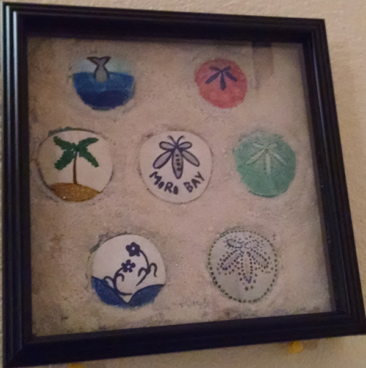

# FEWD-a01
FEWD assignment 1

##Introductions
Hi There, my name is _**Preetha**_. I am a front-end web and interaction designer from San Diego, California.

My background is in software engineering but I am really passionate about designs, both creating and building them on the web. I am currently learning advanced web development in San Diego Continuing Education College. I also love to create hand-crafts whenever I have the time from personal items.

###Things I like to do:
* Create designs using photoshop
* Travel
* Paint or pencil sketch
* Make personal treasure items
* Blog about my projects

###Here is a picture of a sand-dollar artwork I made recently:

Here is a link to my personal [blog](https://howzzart.wordpress.com)
